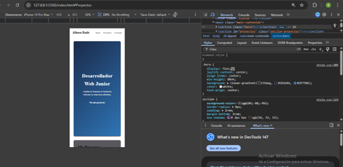
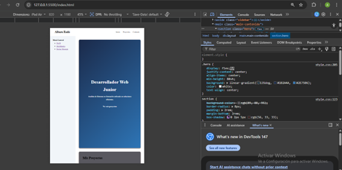

# Portfolio Profesional - Albaro Rodó
### Estudiante de Análisis de Sistemas | Salta, Argentina

**Link al sitio en vivo:** https://albarorodo1234-oss.github.io/tp1-mi-sitio/

## 📝 Descripción
Este proyecto es un portfolio profesional desarrollado para la materia Prácticas Profesionalizantes II. El sitio presenta mi perfil como futuro Analista de Sistemas, utilizando técnicas modernas de diseño web.

## 🚀 Tecnologías Utilizadas
* **HTML:** Estructura semántica.
* **CSS:** Estilos avanzados y variables.
* **Flexbox:** Alineación de componentes internos (Navbar, Hero, Cards).
* **CSS Grid:** Layout bidimensional (Macro-layout y Galería auto-responsive).
* **Responsive Design:** Estrategia **Mobile-First** con 3 breakpoints.

## 📸 Capturas de Pantalla
### Vista Mobile (iPhone 14 Pro - 393px)

### Vista Tablet (iPad Air - 820px)

### Vista Desktop (Laptop - 1024px)
 